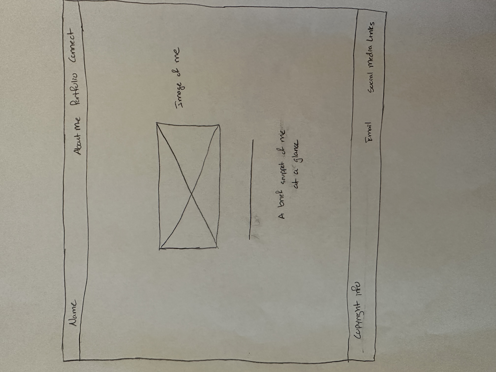
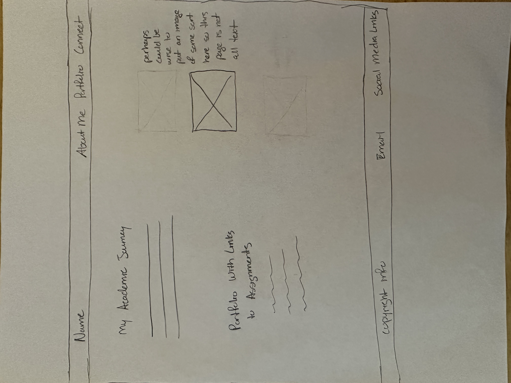
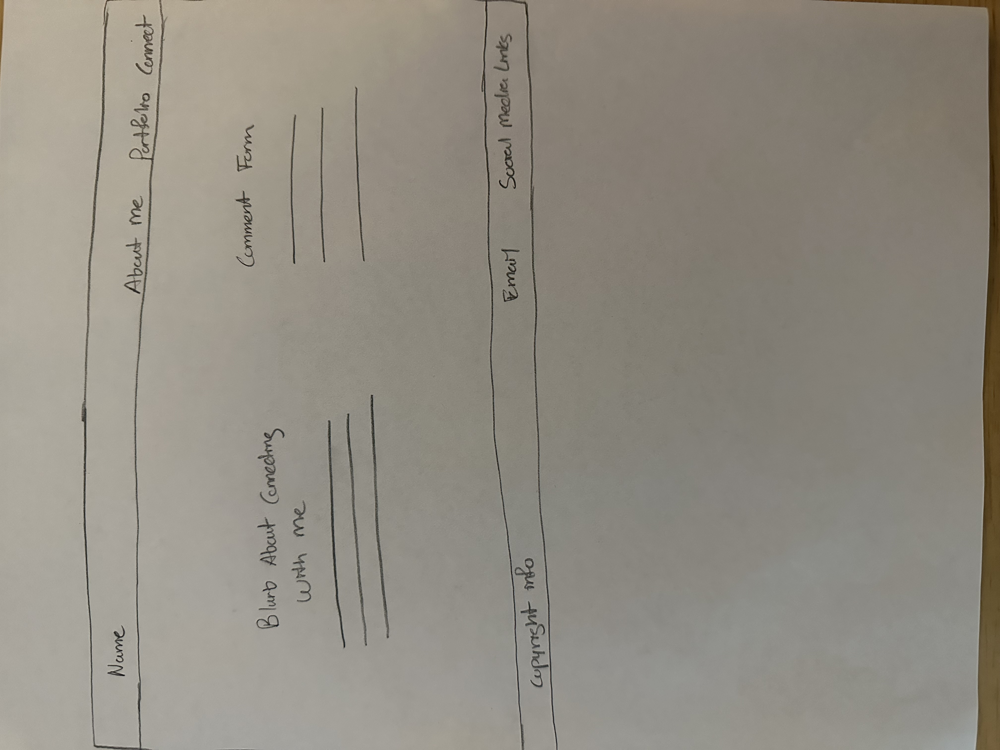

# Steve Kays' INF6420 Project

A portfolio site that will provide info about me, showcase my work, and allow others to get in contact with me.

## Wireframes

Below are pictures of the wireframes that I came up with after thinking through how to best lay out the site. 

Header- Will look to have my name in the top left corner, that will be linked to the home page. Also looking to have a navigation menu in the top right corner. 

Navigation Menu- Will look to include links to other pages. Those pages being "About Me", "Portfolio", and "Connect."

Main Content- As this is the "Home" page, will look to have a prominent picture of me, with a quick and concise blurb, as a relaxing sort of entrance to the site.

Footer- Will include copyright info in the bottom left corner. Will look to have a link to my email and links to my social media accounts in the bottom right corner. 

Header- Linked name in the top left corner. Navigation menu in the top right corner. 

Navigation Menu- Links to other pages on the website. 

Main Content- This is the "About Me" page. Will look to have another quick, slightly different, blurb about me. Also want to include pertinent background info, and perhaps a list of hobbies/interest/etc. Will also look to include multiple related pictures as a way to balance text/visuals.

Footer- Copyright info in the bottom left corner. Link to email, and links to social media accounts, in the bottom right corner.

Header- Linked name in the top left corner. Navigation menu in the top right corner.

Navigation Menu- Links to other pages on the website.

Main Content- This is the "Portfolio" page. Will look to have text highlighting my academic journey, and have links to related assignments/schoolwork. Perhaps a picture on this page as well so it's not just all text?

Footer- Copyright info in the bottom left corner. Link to email, and links to social media accounts, in the bottom right corner. 

Header- Linked name in the top left corner. Navigation menu in the top right corner. 

Navigation Menu- Links to other pages on the website. 

Main Content- This is the "Connect" page. Will look to have text explaining how to get in connect with me. Will also look to have a comment form/section right on the page too. 

Footer- Copyright info in the bottom left corner. Link to email, and links to social media accounts, in the bottom right corner. 